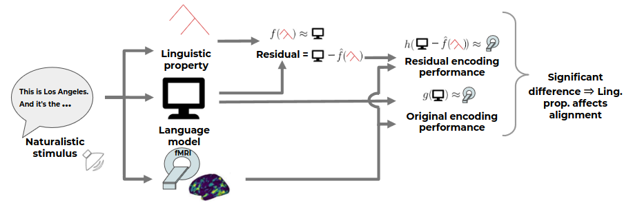

# Joint processing of linguistic properties in brains and language models

[Joint processing of linguistic properties in brains and language models](https://arxiv.org/abs/2212.08094), Subba Reddy Oota, Manish Gupta and Mariya Toneva, NeurIPS-2023



[21<sup>st</sup> year_narratives_listening_dataset](https://figshare.com/articles/dataset/BOLD5000_Release_2_0/14456124)

* 21<sup>st</sup> year dataset statistics:
  
- 18 subjects
- fMRI brain recordings
- 8267 words
- 2226 TRs (Time Repetition)
- TR = 1.5 secs

* How to download 21<sup>st</sup> year dataset
  
* Datalad can be installed using pip

```bash
python -m pip install datalad
```
- It is highly recommended to configure Git before using DataLad. Set both 'user.name' and 'user.email' configuration variables.
```bash
- git config --global user.name "username"
- git config --global user.email emailid
```
- git-annex installation is required for downloading the dataset
```bash
sudo apt-get install git-annex
```

**Download the dataset using datalad**
```bash
datalad install https://datasets.datalad.org/labs/hasson/narratives/derivatives/afni-nosmooth
```

**Download each subject data (considered the fsaverage6) using bash script**
```bash
bash download_data.sh
```

## Poster
[Poster](https://drive.google.com/file/d/1FOpiNJpXma3mlOK0F9nLhcJpJaJSQWsS/view?usp=sharing)

## Slides
[slides](https://drive.google.com/file/d/1dczwbzrHmfitXSINBFRo5B3QcZ_5eGck/view?usp=sharing)

## Video
[Video](https://nips.cc/virtual/2023/poster/72702)

## For Citation of our work
```
@inproceedings{oota2022visio,
  title={Joint processing of linguistic properties in brains and language models},
  author={Oota, Subba Reddy and Gupta, Manish and Toneva, Mariya},
  booktitle={Proceedings of the Thirty-seventh Conference on Neural Information Processing Systems },
  year={2023}
}
```
